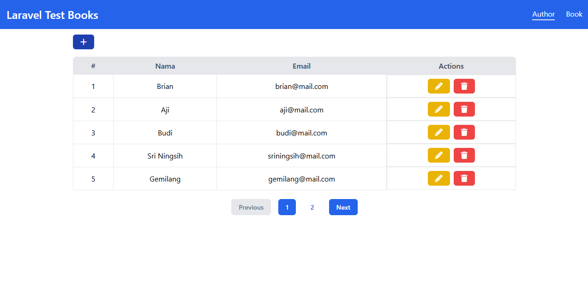
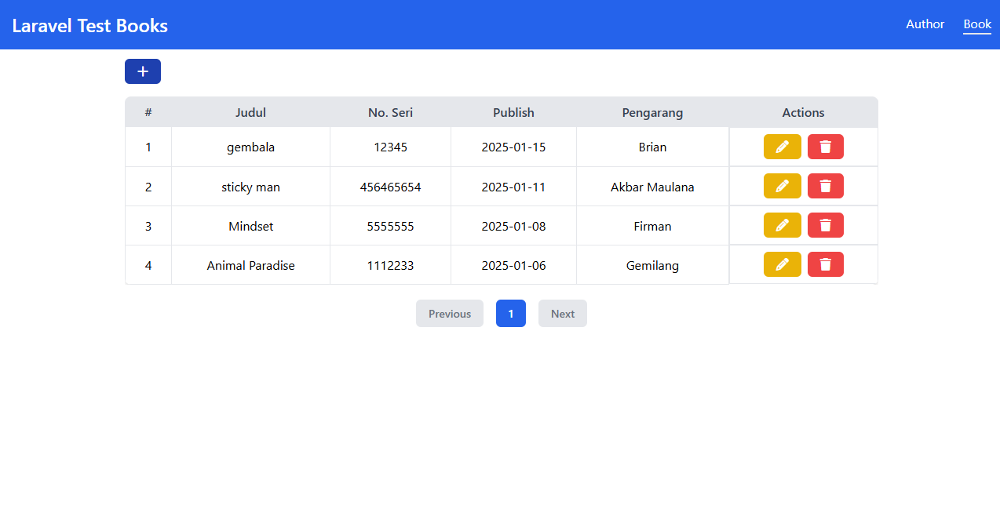

# Laravel Test Books


## Features

- CRUD Author & Book


## Screenshots

- Author


- Book



## Prerequisite:

- Composer >= 2.8
- PHP >= 8.3


## Run Locally

Clone the project

```bash
git clone https://github.com/brianajiks123/laravel-test-books.git
```

Go to the project directory

```bash
cd laravel-test-books
```

Install Dependencies

```bash
composer install
```

Install Packages

```bash
npm install
```

```bash
npm run dev
```

Migrate Database (make sure already setup your environment in the .env file)

```bash
php artisan migrate
```

Running Development

```bash
php artisan serve
```


## Tech Stack:

- Frontend: TailwindCSS
- Backend: Laravel 11, MySQL, Git, Github


## Acknowledgements

 - [Laravel](https://laravel.com/docs/11.x)


## Authors

- [@brianajiks123](https://www.github.com/brianajiks123)
